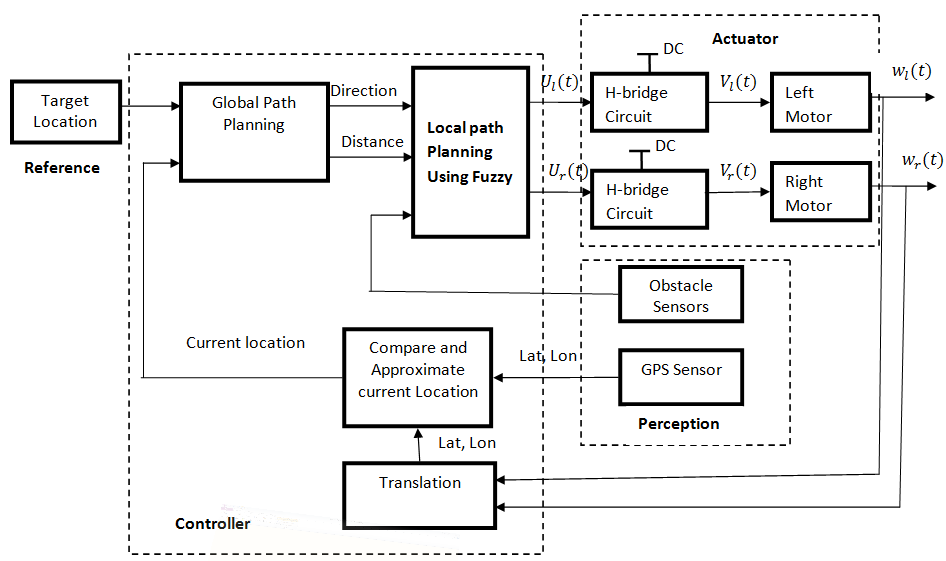
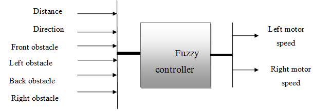
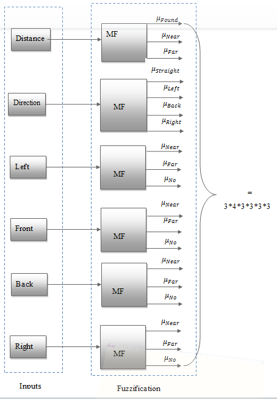
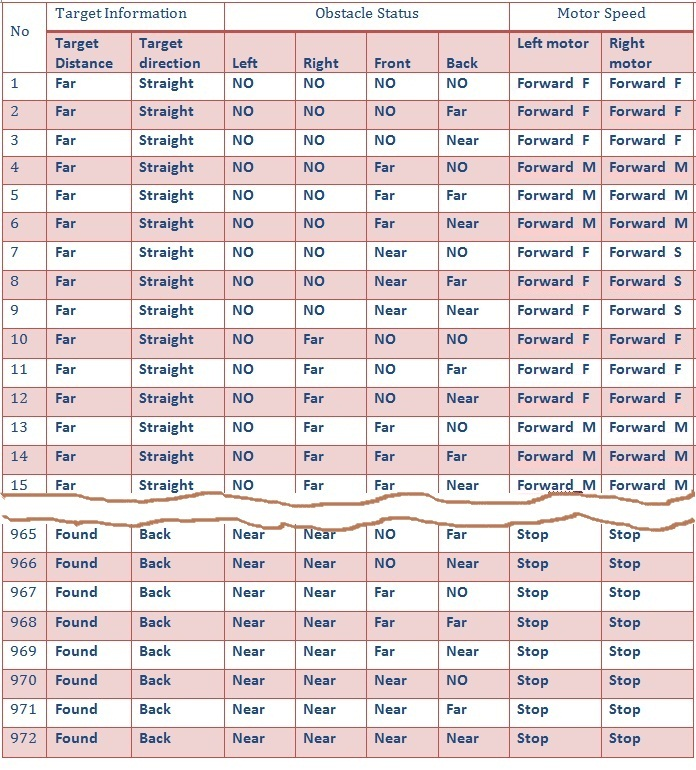
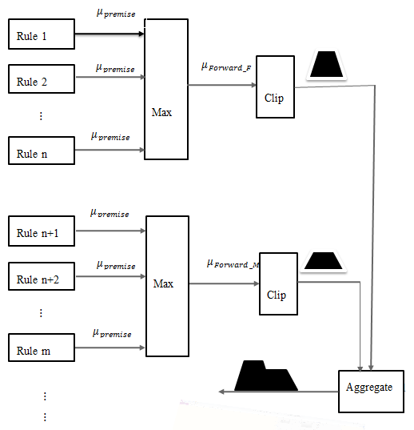
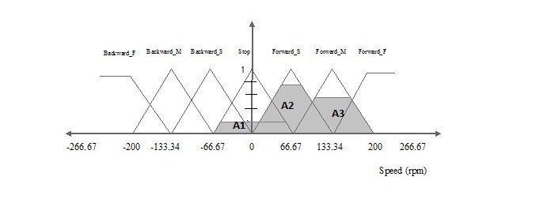
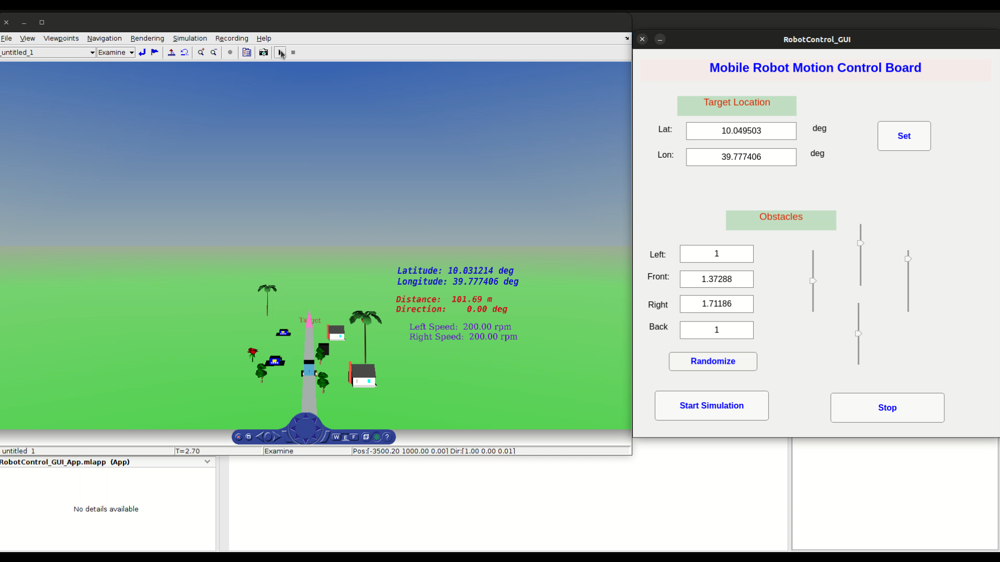

# To run the simulation, execute the following commands in the given order

##  compile the c codes 
  - mex Dis_Dir.c
  - mex fuzzy_ctrl.c

## To load data and open the SIMULINK model, run the matlab script " loadDataAndOpenModel.m" or use the following commands
  - load('Obs.mat')
  - load('path.mat')
  - open('FuzzyMobileRobotGuidance.mdl')
## To run 
  - Go to subblock 'Robot' and double click the 'Robot' 3D animation block
  - Run the simulation

## Configuration
 
  - During the simuation the target location and obstacle condition can be varied using the given GUI application

# System Block Diagram

# Fuzzy implementation hints

## Block diagram

## Fuzzification

## Rule base

## Inference

## Defuzzification

# Simulation Test Result

